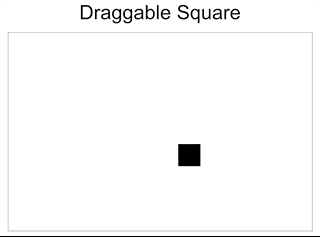
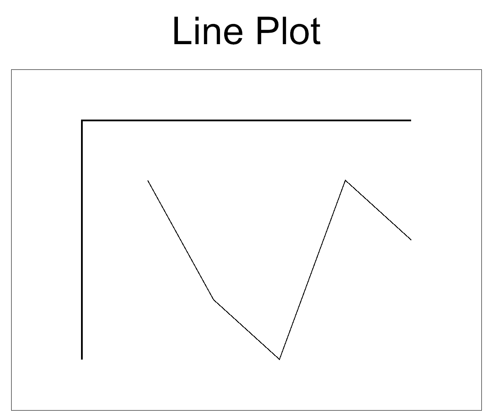

This repo contains personal experiments for learning [iced](https://github.com/hecrj/iced) gui library.

## Draggable Square

```rust
cargo run -- --name draggable
```



## Line Plot

```rust
cargo run -- --name lineplot
```


