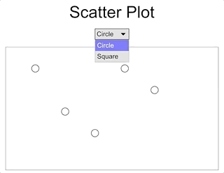
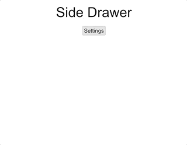
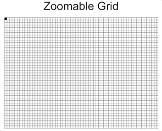
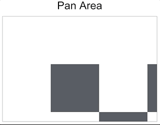

This repo contains personal experiments for learning [iced](https://github.com/hecrj/iced) gui library.

## Draggable Square

```shell
cargo run -- --name draggable
```


## Line Plot

```shell
cargo run -- --name lineplot
```


## Scatter Plot

```shell
cargo run -- --name lineplot
```



## Side Drawer

```shell
cargo run -- --name sidedrawer
```



## Zoomable Grid

Does not pan, simply zooms to the top left corner.

```shell
cargo run -- --name zoomgrid
```



## Pan Area

```shell
cargo run -- --name pan
```


